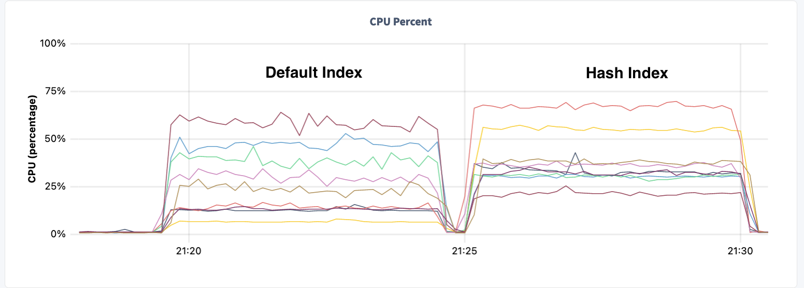
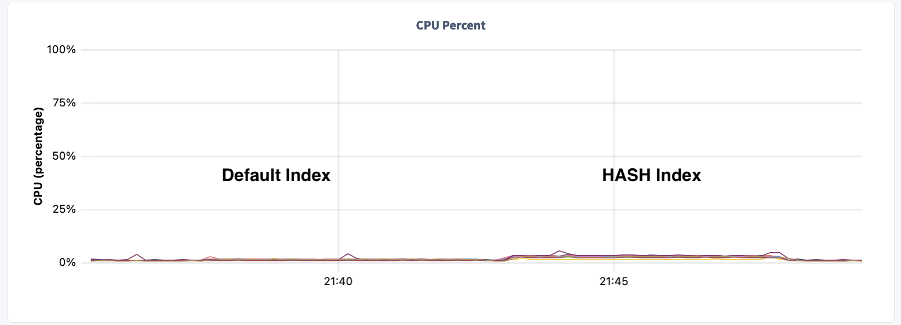
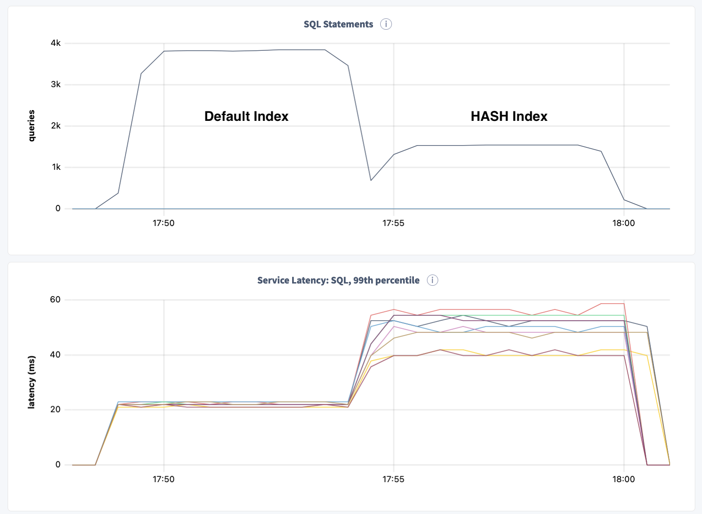
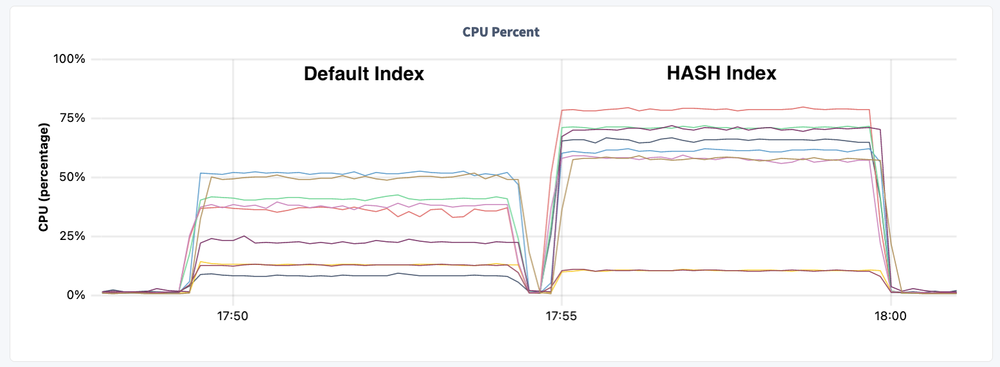

# Range scans with Hash Indexes

## Results

To begin, I want to show the results from the following test #7.  With this test you see that the throughput is throttled at a specific arrival rate desired by the application.  With this environment, you see the RESPONSE time is basically the same for default and HASH indexes.

### Test Indexes that JOIN /w Primary Key

* JOIN with PK
* 18 threads throttled arrival rate of 50 QPS
* 1hr timespan with one sample per second

```json
Q1 idx QPS : 50.0
Q2 hashidx QPS : 50.0
Q1 idx respP90 : 0.2605083227157593
Q2 hashidx respP90 : 0.2714336395263672
```

While the response time is basically the same, the resource utilization is much greater with HASH.  Below is a chart of the CPU utilization for each node in the cluster.


While this is OK, there is still alot of CPU being used for both scenarios.  This is mainly due to the INDEX join required to retrieve data from the BASE table.

```sql
root@localhost:26257/hash> 

EXPLAIN SELECT m100, count(*), sum(v100)
FROM measure@idx_ts
WHERE ts BETWEEN '2000-06-01 00:00:00.000000' and '2000-06-02 00:00:00.000000'
GROUP BY m100
ORDER BY 3 desc
LIMIT 10;
                                     info
------------------------------------------------------------------------------
  distribution: full
  vectorized: true

  • limit
  │ count: 10
  │
  └── • sort
      │ order: -sum
      │
      └── • group
          │ group by: m100
          │
          └── • index join
              │ table: measure@primary
              │
              └── • scan
                    missing stats
                    table: measure@idx_ts
                    spans: [/'2000-06-01 00:00:00' - /'2000-06-02 00:00:00']
```


### Test Indexes with STORING clause

Doing an index range scan might be sequential, but it fans out to be scatter/gather from the BASE table.  This is because the `PK` is ordered by the `id` and not timestamp.  To better optimize, we can use the `STORING` clause to include all columns projected.  For this test, a second table `measure2` was created with the following indexes:  

* `INDEX idx_ts (ts ASC) STORING (m100, v100)` 
* `INDEX idx_tshash (ts ASC) USING HASH WITH BUCKET_COUNT = 9 STORING (m100, v100)`

Using the new `measure2` table, the resource utilization is **MUCH** lower:


... decreases to...


and response time dropped more than 10x!!

```json
Q1 idx respP90 : 0.2605083227157593
Q2 hashidx respP90 : 0.2714336395263672

---vvvv---

Q1 idx respP90 : 0.01097574234008789
Q2 hashidx respP90 : 0.021715378761291503
```

It is worth noting that the performance difference between the two queries is much more apparent when the fan-out to join with the PK is removed.  The hash index response time 90th percential is `21.7ms` vs `10.9ms` with the default index structure.

### Scaling Throughput

Now that the indexes are optimized, it is worth testing the boundries. Both default indexes and HASH are able to deliver more the 1000 QPS for this workload, but indeed the default index structure is more efficient and scales further.

```json
Q1 idx QPS : 3831.0433333333335
Q2 hashidx QPS : 1539.8033333333333

Q1 idx respP90 : 0.01582789421081543
Q2 hashidx respP90 : 0.035750627517700195
```



## Final Thoughts

Index range scans are certainly better optimized for using a traditional index structure with CockroachDB where the values are sorted.  That said, CockroachDB has optimized the HASH index as well to efficiently range SCAN each bucket concurrently in-order to provide reasonable response times as long as HW resources are available.
