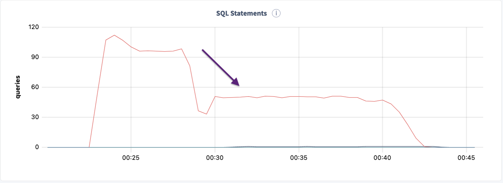
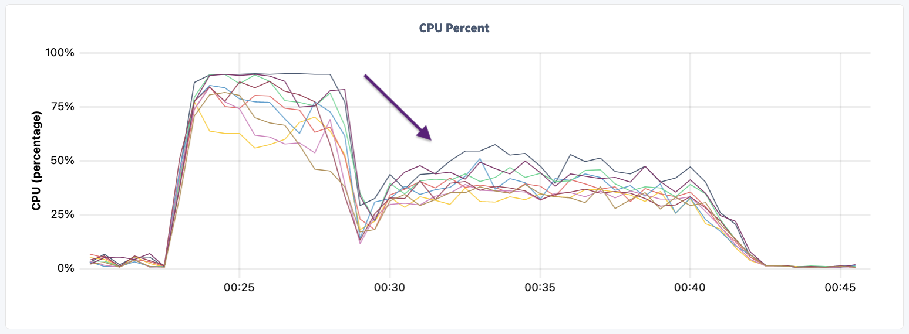

# Trimmer TTL tool

It is common for applications to only keep data for a useful period of time.  Keeping data around too long uses extra resources and associated cost.  In the best case scenario this functionality is built into the application itself, but that is not always the case.  Often this is done by the database operations team using functionality built into the database.  At this point in time, CockroachDB does not have a Time-To-Live or partitioning strategy to accomplish this task.

To best optimize trimming of unneeded data, I created a tool that can efficiently trim data in parallel while limiting the performance impact on current work.

## Trimmer Design

There are several key factors for trimmer design to implement TTL for rows in CRDB:

* Last Update via `crdb_internal_mvcc_timestamp` 
* Table statistics of the primary key /w histogram
* `DELETE` with CTE using `LIMIT` and `RETURNING` clause
* Rate limiter for trimmer

### MVCC timestamp

The `crdb_internal_mvcc_timestamp` timestamp shows the cluster timestamp of when the row was last updated.  This represents the time data was committed to the database and is key to the operations of CRDB.  The `crdb_internal_mvcc_timestamp` is the EPOCH in nanoseconds so it can be converted to a true timestamp like so:

```sql
SELECT min((crdb_internal_mvcc_timestamp/10^9)::int::timestamptz) from mytable;
```

Using the `crdb_internal_mvcc_timestamp` value can be real useful to determine HOW many rows need to be deleted from the database.  Consider the following query that shows how many rows are **STALE** based on a particular timestamp threshold.

```sql
WITH dstate as (
    SELECT 
        CASE WHEN (crdb_internal_mvcc_timestamp/10^9)::int::timestamptz <  '2021-09-22 00:45:04.350686+00'::timestamptz
                THEN 'stale'
            ELSE 'current'
        END as data_state
FROM mytable
)
SELECT data_state, count(*)
FROM dstate
GROUP BY 1;

data_state |  count
-------------+----------
current    | 1255184
stale      |  160618
```

### Delete by primary key using table statistics /w histograms

Table statistics are key for the optimizer to determine the right plans and optimize query performance.  Statistics contain a road map of table distribution which is extremely useful to parallelize concurrent operations.  The table distribution road map is contained in the histograms for various columns.  The query below shows how to show the statistics for the `bigfast` table. 

```sql
root@localhost:26259/defaultdb> show statistics for table bigfast;

statistics_name | column_names |          created           | row_count | distinct_count | null_count |    histogram_id
------------------+--------------+----------------------------+-----------+----------------+------------+---------------------
__auto__        | {id}         | 2021-09-20 23:51:09.943695 |    100000 |         101169 |          0 | 695046864748118018
__auto__        | {ts}         | 2021-09-20 23:51:09.943695 |    100000 |              1 |          0 | 695046865054990338
__auto__        | {delboolean} | 2021-09-20 23:51:09.943695 |    100000 |              2 |          0 | 695046865316610050
__auto__        | {s}          | 2021-09-20 23:51:09.943695 |    100000 |              1 |          0 | 695046865464688642
(4 rows)
```

Once we have the statistics _and_ know the primary key, we can use the most recent `histogram_id` to determine the ranges of values that can be used by each thread to delete old rows from the table. Our current implementation has a histogram of 200 equal buckets as show below.

```sql
root@localhost:26259/defaultdb> show histogram 695046864748118018;

            upper_bound               | range_rows | distinct_range_rows | equal_rows
-----------------------------------------+------------+---------------------+-------------
'0001ee1b-62ae-4d4b-9e12-ef0c471222d8' |          0 |                   0 |         10
'014ad878-ec1c-4fe1-88d5-8caf2b362d23' |        490 |             504.845 |         10
'02837889-1f80-4ee8-9708-17f0b3ede0e0' |        490 |             504.845 |         10
'039647a7-9f83-48c4-a5cb-802881ef9eac' |        490 |             504.845 |         10
'04ba6e77-8322-472f-8c0c-668815904cf8' |        490 |             504.845 |         10
'05b28217-6374-4378-bd43-421bef849d8e' |        490 |             504.845 |         10
'06d08d4a-8f1e-4f18-b9a8-d9cc01a8ecd1' |        490 |             504.845 |         10
'07ec15d5-3f51-469e-908d-153207af7c70' |        490 |             504.845 |         10
'09542dd6-a038-436c-9ec2-55f31752522c' |        490 |             504.845 |         10
'0aaa22ca-7935-4506-a801-d3035466e564' |        490 |             504.845 |         10
'0bd1c56c-c941-47e6-8388-f32b5498bd2f' |        490 |             504.845 |         10
'0cc4bf41-1f77-4861-ae5b-5fa91078abfa' |        490 |             504.845 |         10
'0e79e489-7e67-42d9-8ce6-61547758579d' |        490 |             504.845 |         10
'0f970f1c-3a5f-4b9a-82bc-cd6fefb2d102' |        490 |             504.845 |         10
'10ce30d1-3675-4d07-8696-469f85430c91' |        490 |             504.845 |         10
'11b7245a-30aa-442c-9a7d-9c8dff10e0ae' |        490 |             504.845 |         10
'12ce0479-110f-4f59-9362-3af6aefb95f8' |        490 |             504.845 |         10
'13e54402-72b0-487b-8944-897ad8ad13ba' |        490 |             504.845 |         10
'15c449c3-a063-4c42-b744-4b2a9ce77599' |        490 |             504.845 |         10
'17317b51-0d47-4412-9f38-78f8d47a83d6' |        490 |             504.845 |         10
'18c4a41f-1160-48c8-94fa-18ee57fb9d52' |        490 |             504.845 |         10
'1a175de5-a4ad-461e-9a7b-8140707eebd2' |        490 |             504.845 |         10
'1b617847-1763-44e0-8129-5adb0a53d254' |        490 |             504.845 |         10
'1ca8827a-92cf-474c-9570-d9c42a1ba88e' |        490 |             504.845 |         10
'1e05cb5e-f0df-4c28-87c6-c8a232469802' |        490 |             504.845 |         10
'1f06085a-4257-4c7f-8fde-d7762d5a97e8' |        490 |             504.845 |         10
'2056ec58-dbab-49bd-8600-0ea59a858c98' |        490 |             504.845 |         10
'2194f747-2280-4c09-97e6-17ea71803940' |        490 |             504.845 |         10
'22ce028d-8ebe-45e5-b5ce-8892a30640f0' |        490 |             504.845 |         10
... 
...
'fa7c4387-f822-46e0-946e-6a728254fc0a' |        500 |   515.1479591836735 |         10
'fbd6c546-9969-4f1a-afe3-2e5712051d76' |        500 |   515.1479591836735 |         10
'fd503c07-1d30-43c9-b48c-572a301a3961' |        500 |   515.1479591836735 |         10
'feb26b34-dc0d-4260-a116-f4d805c7b8c2' |        500 |   515.1479591836735 |         10
'fffda92a-687d-4886-a079-4f16af3577df' |        500 |   515.1479591836735 |         10
(200 rows)
```

### Trimmer Tool metadata tables

Now that we have the distribution defined with equal buckets, we can create parallel threads to delete rows from the table.  To keep track of the activity and report on the progress, a few tables are created for the trimmer process. These tables are used by the trimmer process to keep track of:

* Range of values to delete
* Last value deleted
* Number of rows rows deleted
* Timing of the delete operations

```sql
CREATE TABLE delthreads (
    id INT PRIMARY KEY,
    bval STRING,
    eval STRING
);

CREATE TABLE delruntime (
    id INT, 
    ts TIMESTAMP DEFAULT now(),
    lastval UUID,
    rowsdeleted INT,
    delpersec INT,
    PRIMARY KEY (id, ts)
);
```

### CTE with LIMIT and RETURNING clause

Using a Common Table Expression (CTE), rows are deleted while tracking the timing and count of rows deleted as shown by the example below:

```sql
WITH delthread as (
    DELETE
    FROM mytable
    WHERE             
        id BETWEEN '00000000-0000-0000-0000-000000000000' AND '014ad878-ec1c-4fe1-88d5-8caf2b362d23'
        AND (crdb_internal_mvcc_timestamp/10^9)::int::timestamptz < '{}'::timestamptz
    LIMIT 100
    RETURNING (id)
)
INSERT INTO delruntime (id, lastval, rowsdeleted)
SELECT thread_number, max(id), count(*) FROM delthread
RETURNING lastval, rowsdeleted;
``` 

### Usage

The [trimmer_by_mvcc.py](trimmer_by_mvcc.py) python3 script has multiple options in order to control the trimming process.

```js
python3 ./trimmer_by_mvcc.py -h

usage: trimmer_by_mvcc.py [-h] [-v] [-H HOST] [-d DATABASE] [-r ADMINPORT] [-p DBPORT] [-u USER] [-b BATCH] -t TABLE -k {UUID,INT} -i PKNAME [-s RPS] -z TSB  [-c]

Trim table by PK for CockroachDB based on MVCC timestamp

optional arguments:
-h, --help            show this help message and exit
-v, --verbose         Verbose logging
-H HOST, --host HOST  Host AdminUI
-d DATABASE, --db DATABASE  Database Name
-r ADMINPORT, --adminport ADMINPORT  AdminUI Port
-p DBPORT, --dbport DBPORT  Database Port
-u USER, --user USER  Datbase User
-b BATCH, --batch BATCH  Number Rows to delete per Batch
-t TABLE, --table TABLE  Name of Table to Trim
-k {UUID,INT}, --pktype {UUID,INT}  Primary Key Type
-i PKNAME, --pkname PKNAME  Primary Column Name
-s RPS, --rps RPS     Target Delete RPS throttle... 0 disables
-z TSB, --barrierTimestamp TSB  TimeStamp Barrier ie... 2021-09-28 18:30:00.000000
-c, --noCheckBarrier  Disable Precheck Rows Timestamp Barrier
```

## Trimmer Example Runs

The example below shows trimming for the `bigfast` table.  An insert program was created to insert data to stress the ingest process.  This table as has a sample of `UUID`, `STRING`, `INT`, `TIMESTAMP`, and `JSONB` data types.  Two scenarios were tested with and without the rate limiter using a batch size of 200 rows:

* `--batch 200` deletes 200 rows per commit
* `--rps 10000` limits delete rate to 10,000 rows per second

```js

python3 ./trimmer_by_mvcc.py --table bigfast --pktype UUID --pkname id --batch 200 --barrierTimestamp '2021-09-29 14:00:00.000000' --noCheckBarrier

-------------------------------------------------------------------------------------------
--- DELETE stale rows in table 'bigfast'
---      less than '2021-09-29 14:00:00.000000' based on MVCC timestamp
---      BatchSize: 200 rows per thread
---      Target Delete rowsPerSec: UNLIMITED
-------------------------------------------------------------------------------------------

199 Threads Spawned

--------------------------------------------
--- Final Report
--------------------------------------------
     BeginDeleteProcess : 2021-10-04 00:22:57.759291
       EndDeleteProcess : 2021-10-04 00:29:22.894586
            runtime_sec : 385.135295
     total_rows_deleted : 7000117
rows_deleted_per_second : 18176.0

python3 ./trimmer_by_mvcc.py --table bigfast --pktype UUID --pkname id --batch 200 --barrierTimestamp '2021-09-29 14:10:00.000000' --rps 10000 --noCheckBarrier

-------------------------------------------------------------------------------------------
--- DELETE stale rows in table 'bigfast'
---      less than '2021-09-29 14:10:00.000000' based on MVCC timestamp
---      BatchSize: 200 rows per thread
---      Target Delete rowsPerSec: 10000
-------------------------------------------------------------------------------------------

199 Threads Spawned

--------------------------------------------
--- Final Report
--------------------------------------------
     BeginDeleteProcess : 2021-10-04 00:29:30.692103
       EndDeleteProcess : 2021-10-04 00:42:12.801964
            runtime_sec : 762.109861
     total_rows_deleted : 7018998
rows_deleted_per_second : 9210.0
```

By limiting the `DELETE` rate to the trimmer process, the CPU usage can be controlled so as not to flood the cluster with TTL work.




